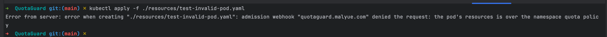

## QuotaGuard - Kubernetes Dynamic Quota Admission Webhook

QuotaGuard is a Kubernetes Validating Admission Webhook that enforces custom quota policies (defined via QuotaPolicy CRDs) during Pod creation/modification.
It prevents resource overcommitment by validating workloads against dynamic rules.

### Key Features:
- **Dynamic Quota Rules**: QuotaGuard dynamically calculates resource usage for each namespace and enforces custom quota policies.
- **Flexible Scoping: Apply policies to Namespaces, Teams (other scope should be supported in the future ...)
- **Easy to Use**: QuotaGuard is designed to be easy to use and understand, it is a easy project to learning webhook and operator

### How to use:
`make all` and you can use `kubectl apply -f ./resources/test-quotapolicy.yaml` `kubectl apply -f ./resources/test-invalid-pod.yaml` to check the webhook
